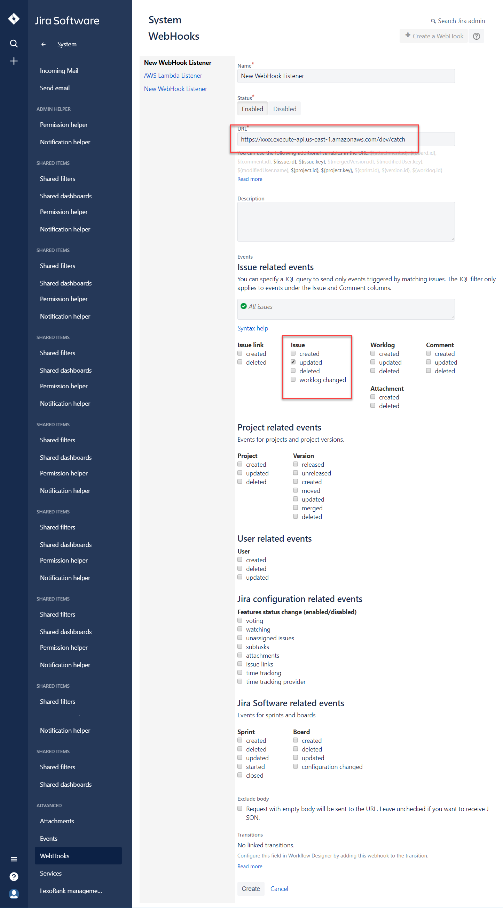
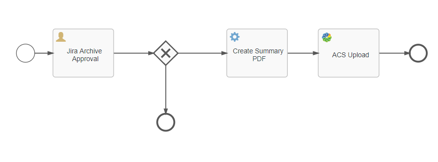

Devcon 2018 - "APS+Serverless+Webhooks Demo"
============

This is the demo code used for my talk on integrating 3rd party SaaS applications (Jira) with Alfresco Process Services (APS) and Amazon Lambda.

This is example is using Jira, but the basic pattern could be applied to other SaaS applications (SalesForce, Slack, Twillio, Asana etc..) 

Instructions
------------

AWS Lambda using node.js and the Serverless Framework
------------
Update resource variables to match your invironment.

Install the [AWS CLI](https://aws.amazon.com/es/cli/) and setup [your AWS credentials.](https://www.youtube.com/watch?v=HSd9uYj2LJA)

Install the [Serverless Framework via npm.](https://serverless.com/)

```
npm install -g serverless
```

Modify the variables to match your APS and Jira environments.  e.g. hosts, ports, credentials.

Install and Deploy to AWS Lambda
```
sls deploy
```

Note the the urls generated e.g. 
https://xxxx.execute-api.us-east-1.amazonaws.com/dev

Test the GET endpoint using Postman or browsing to https://xxxx.execute-api.us-east-1.amazonaws.com/dev/catch .  "Hello World" should be returned in the browser if the Lambda Funtion was deployed and the API Gateway configured properly

Create a Webhook in Jira
------------
In Jira, browse to Administration->Jira->System->Webhooks

Create a new webhook using the url generated in Step 1.
For the event choose Issue->Updated



Deploy the APS application
------------
Import the process app archive (Jira Issue Management.zip) via App Designer -> Apps -> Import App
Deploy the app by clicking on the "Publish" button.


Running the Application
------------
Create a new issue in Jira.  Add a description and a few attachments then the issue as Done.

A webhook/Lambda function will be invoked on each update to the issue.  When the Lamnda Funciton executes it will check to see if the Jira has been marked as Done.  When an issue is "Done" the Lambda function will start a new APS process passing along several variables to the start form and then upload any attachments with the Jira into the APS process.



